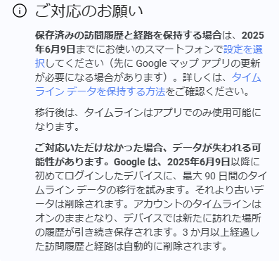
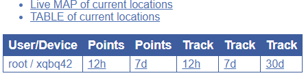
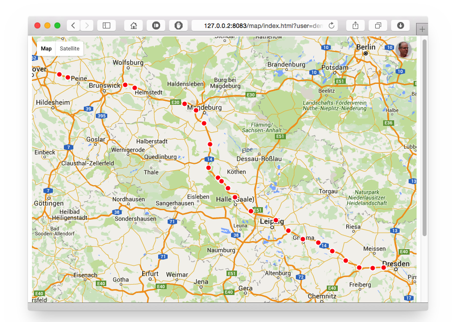
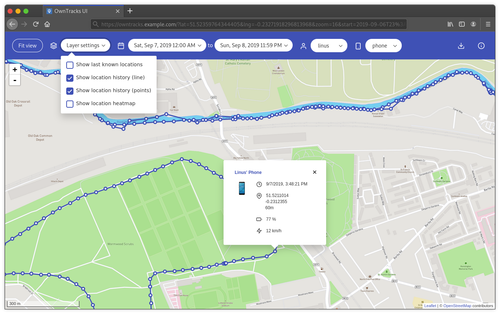
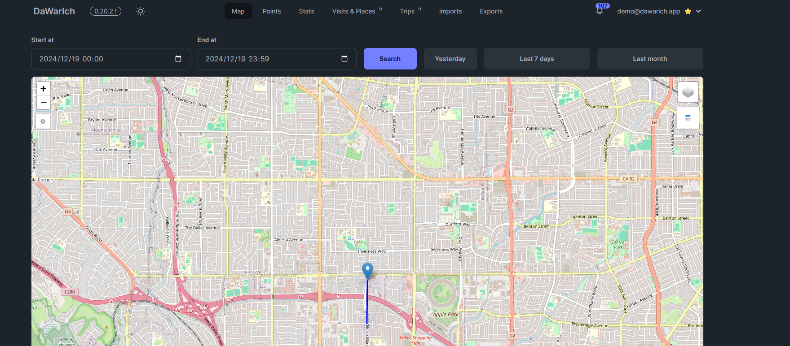
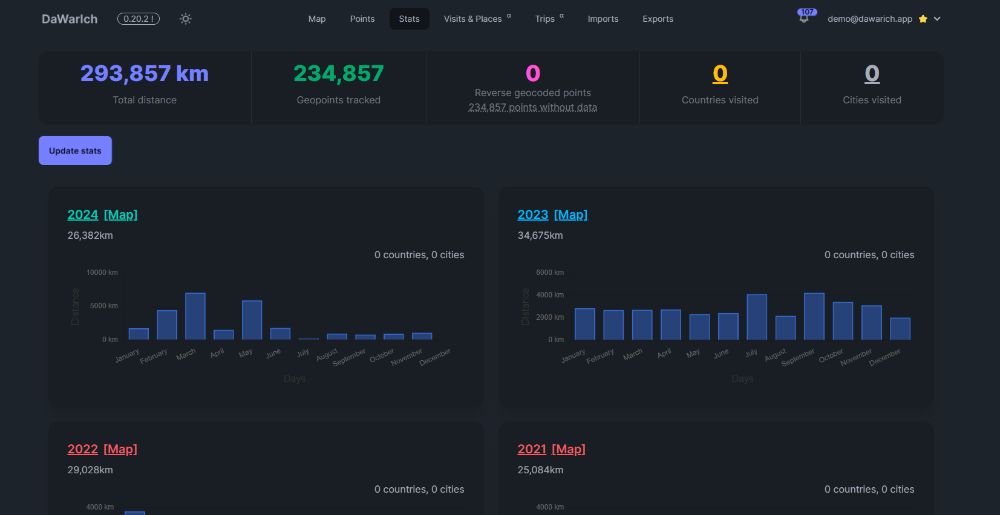
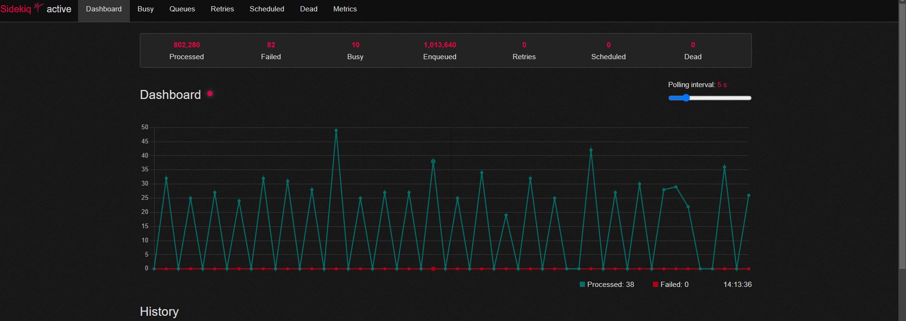

## この記事は, <a href="https://adventar.org/calendars/10770">MMA Advent Calendar 2024</a> 23日目の記事です．

Google からこんな通知が来ました. 2025/06/09 までにスマホで設定しないとこれまでのロケーション履歴が消えてしまうみたいです. 今月までだったのが延長されたみたいですがなかなかに厳しいですね.




今後は端末にデータが保存され, あくまでバックアップという形でGoogle サーバーに保存されることになります.
実際に設定を変更すると他の端末やWebからはアクセスできなくなりました. 日記を書き溜めたときや, ふとした時にロケーション履歴を見返すことがあったので, これは困りました.

そこで, Googleに頼らないセルフホスティングで位置情報を保存しブラウザで見ることができるツールを調べて試したので紹介します.

## <a href="https://owntracks.org/">OwnTracks</a>
OwnTracks はオープンソースプロジェクトの位置情報トラッキングツールです. これを使用することで, スマホアプリから位置情報を自分のサーバーに送ることができます. ネットワークが無いところでもアプリ内にバッファーされるので, 後からサーバーに送信することができます.

Android:<a href="https://play.google.com/store/apps/details?id=org.owntracks.android&hl=ja">OwnTracks</a>, IOS:<a href="https://apps.apple.com/us/app/owntracks/id692424691">OwnTracks</a>

### 使い方
今回はDockerイメージを使用することで簡単にセットアップしました.
recorder と frontend の2つイメージを使用します.
recorder は位置情報を受け取り月ごとのファイルに保存し, frontend は保存された位置情報を表示します.

1.最低限の`docker-compose.yml` を追加.

```yml
services:
  otrecorder:
    image: owntracks/recorder
    ports:
      - 8083:8083
    volumes:
      - ./config:/config
      - ./store:/store
    restart: unless-stopped
    environment:
      - OTR_PORT=0
  owntracks-frontend:
    image: owntracks/frontend
    ports:
      - 80:80
    volumes:
      - ./path/to/custom/config.js:/usr/share/nginx/html/config/config.js
    environment:
      - SERVER_HOST=otrecorder
      - SERVER_PORT=8083
    restart: unless-stopped
volumes:
  store:
  config:

```

2.`docker compose up -d` で起動.

3.スマホアプリでエンドポイントをhttp://localhost:8083/pub にして位置情報を送信.

4.http://localhost:8083 にアクセスすると以下のように表示されます.

<div style="text-align: center;">
http://localhost:8083
</div>

docker-compose.yml を編集することで, より詳細な設定ができます. <a href="https://mqtt.org/">MQTT</a>による通信も可能です.

下図のように直近30日までの位置情報を表示することができます.

<div style="text-align: center;">
マップで表示される位置情報  (公式リポジトリから引用)
</div>

6.http://localhost にアクセスすると以下のように表示されます.
これで時間指定検索や過去の位置情報を確認することができます.
ただ, 月ごとに大量のrecファイルが作成され, それを読み込んでいるのでデータが増えたときにロード時間が長くなる可能性があります. データベースを使ったほうがいいかもしれないです.

<div style="text-align: center;">
マップで表示される位置情報  (公式リポジトリから引用)
</div>


参考:

<a ref="https://youtu.be/ZRbkY4zcjnc?si=1PYo_iGa7rak1Qsg">Track Your Location with OwnTracks</a>

公式リポジトリ: <a ref="https://owntracks.org/">OwnTracks</a>

## <a href="https://dawarich.app/">dawarich</a>

<div style="text-align: center;">
マップ  (公式サイトから引用)
</div>


DawarichはGoogle Timeline の代替としてEvgenii Burmakin 氏が絶賛開発しているプロジェクトです. Owntracsのエンドポイントをこの写真をマッピングできたり, 訪れた国や都市の表示, 旅行の記録などGoogle Timeline と同じような機能を提供しています. しかもかっこいい !

<div style="text-align: center;">
統計情報  (公式サイトから引用)
</div>

### 使い方
リポジトリをクローンして, `docker-compose up -d` で起動します.
Google Timeline のデータをダウンロードして, そのデータをdawarichにアップロードすることで, これまでの位置情報を表示することができます. やり方については
<a href="https://dawarich.app/blog/migrating-from-google-location-history-to-dawarich">開発者のブログ</a>
を参照してください.
60MB のGoogle Takeout からダウンロードした6年分のRecords.jsonをインポートするのに数日かかりました.
ただ,
http://localhost:3000/sidekiq/
にて処理状況が以下のように表示されます.


<div style="text-align: center;">
http://localhost:3000
</div>

OwnerTracks のアプリのエンドポイントを以下のように設定することで, 位置情報をdawarichに送信することができます.
```
http://<your-dawarich-instance>/api/v1/owntracks/points?api_key=<your-api-key>
```
### Records.json の加工
dawrich にインポートするGoogle Takeout からダウンロードしたRecords.json ですが, はずれ値が結構多く含まれていました. そこで, 時刻と座標, 精度を元にフィルタリングするスクリプトを作成しました.詳しくは, https://github.com/namoron/googlemapping に書きました.

無事に, 明らかにおかしい座標を取り除けてデータ量も半分以下にすることができました.

```python
import json
from datetime import datetime
# 速度の閾値（km/h）
SPEED_THRESHOLD = 1500
# 位置情報の精度の閾値（m）
ACCURACY_THRESHOLD = 1000
# 速度が閾値を超えた場合の停止期間
STOP_THRESHOLD = 10
# 入力ファイル名
INPUT_FILENAME = './Data/Records.json'
# 出力ファイル名
OUTPUT_FILENAME = './Data/FilteredRecords.json'

# 速度計算
def calculate_speed(lat1, lon1, lat2, lon2, time_diff):
    # 緯度・経度の差から距離を計算（概算）
    distance = ((lat2 - lat1) ** 2 + (lon2 - lon1) ** 2) ** 0.5 * 111  # km換算
    return (distance / (time_diff / 3600)) if time_diff > 0 else 0

# 位置情報データのフィルタリング
def filter_location_data(INPUT_FILENAME, OUTPUT_FILENAME):
    with open(INPUT_FILENAME, 'r') as infile:
        data = json.load(infile)

    filtered_locations = []
    previous_entry = None
    stop_count=0
    for entry in data['locations']:
        try:
            buff={}
            accuracy = entry.get('accuracy', float('inf'))
            timestamp = entry['timestamp']
            lat = entry['latitudeE7'] / 1e7
            lon = entry['longitudeE7'] / 1e7

            # 時間差と速度計算の準備
            if previous_entry:
                prev_lat = previous_entry['latitudeE7'] / 1e7
                prev_lon = previous_entry['longitudeE7'] / 1e7
                prev_time = datetime.fromisoformat(previous_entry['timestamp'][:-1])
                curr_time = datetime.fromisoformat(timestamp[:-1])
                time_diff = abs((curr_time - prev_time).total_seconds())
                speed = calculate_speed(prev_lat, prev_lon, lat, lon, time_diff)
                # 速度が閾値を超えた場合は一定期間データ削除
                if speed >=SPEED_THRESHOLD:
                    stop_count= STOP_THRESHOLD
                if stop_count > 0:
                    stop_count-=1
            else:
                speed = 0

            # 条件に基づきデータをフィルタリング
            if accuracy <= ACCURACY_THRESHOLD and speed <= SPEED_THRESHOLD and stop_count == 0:
                filtered_locations.append({
                    'latitudeE7': entry['latitudeE7'],
                    'longitudeE7': entry['longitudeE7'],
                    'accuracy': accuracy,
                    'source': entry.get('source'),
                    'deviceTag': entry.get('deviceTag'),
                    'deviceDestination': entry.get('deviceDestination'),
                    'timestamp': timestamp
                })

            previous_entry = entry

        # データが不完全な場合はスキップ
        except (KeyError, ValueError):
            continue

    # フィルタリング結果を新しいJSONファイルに保存
    with open(OUTPUT_FILENAME, 'w') as outfile:
        json.dump({'locations': filtered_locations}, outfile, indent=4)

if __name__ == '__main__':
    filter_location_data(INPUT_FILENAME, OUTPUT_FILENAME)
```

