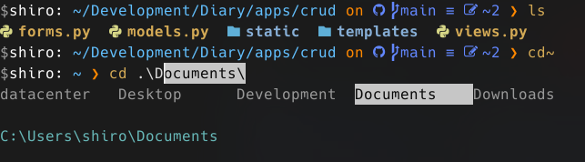

## 概要

デフォルトの PowerShell が気に入らなかったので WSL や Clink,cmd を試した結果 1 週回って PowerShell に落ち着いた

#### 良かったこと

- 標準の ls を消して を eza として割り当てることで ls コマンドがきれいになった.
- Tab 補完が使いやすくなった.
- Oh My Posh で デザインが良くなった.
<br>
<br>


<div style="text-align: center;">
  完成図
</div>

### 使用ツール

- PowerShell
- Oh My Posh
- eza

### 最低限
Powershell のプロファイルの上部を書いておけば幸せになります.

### Powershell のプロファイル

##### "C:\Users\ {{"user_name"}}\OneDrive\Documents\PowerShell\Microsoft.PowerShell_profile.ps1"

```ps1
remove-item alias:ls
Import-Module posh-git

Set-PSReadLineOption -PredictionSource History
Set-PSReadLineKeyHandler -Key Tab -Function MenuComplete

# set-alias ls eza

function ls() {
    eza --icons --git
}
function la() {
    eza -a --icons --git
}
function ll() {
    eza -aahl --icons --git
}
function lt() {
    eza -T -L 3 -a -I 'node_modules|.git|.cache' --icons
}

#とりあえず以上を書いとけば幸せ
#######################################################################################
# 以下はおまけ

set-alias vi "C:\Program Files\Vim\vim90\vim.exe"
set-alias vim "C:\Program Files\Vim\vim90\vim.exe"

function Invoke-As-Admin() {
    if ($args.count -eq 0) {
        gsudo
        return
    }
    $cmd = $args -join ' '
    gsudo "pwsh.exe -Login -Command { $cmd }"
}

Set-Alias -Name: "sudo" -Value: "Invoke-As-Admin"

Import-Module "$($(Get-Item $(Get-Command scoop.ps1).Path).Directory.Parent.FullName)\modules\scoop-completion"

oh-my-posh init pwsh --config "$env:POSH_THEMES_PATH\sample.omp.json" | Invoke-Expression
#oh-my-posh init pwsh --config '"C:\Users\shiro\scoop\apps\oh-my-posh\current\themes\illusi0n.omp.json"' | Invoke-Expression
# Invoke-Expression (&starship init powershell)
set-psreadlineoption -predictionsource history

$ENV:STARSHIP_CACHE = "$HOME\AppData\Local\Temp"
Register-ArgumentCompleter -CommandName ssh, scp -Native -ScriptBlock {
  param($wordToComplete, $commandAst, $cursorPosition)

  # .ssh\config　からHost項目の一覧を取得
  $sshConfigHostList = (Get-Content ~\.ssh\config).trim() -replace "\s+", " " | Select-String -Pattern "^Host\s" | ForEach-Object { $_ -split "\s+" | Select-Object -Skip 1 }

  # Host一覧 から　入力値（$wordToComplete）に合致する物を補完対象。
  # [System.Management.Automation.CompletionResult]を生成して返す
  $sshConfigHostList | Where-Object { $_ -like "$wordToComplete*" } | ForEach-Object {
    $resultType = [System.Management.Automation.CompletionResultType]::ParameterValue
    # CompletionResult Class
    # completionText , listItemText , resultType toolTip
    [System.Management.Automation.CompletionResult]::new($_, $_, $resultType , $_)
  }
}

if(-not $env:path.Split(';').Contains('.')){
    $env:path += ";."
}


```

### wezterm のプロファイル

##### C:\Users\ {{"user_name"}}\.config\wezterm\wezterm.lua

```lua
local wezterm = require 'wezterm';
local act = wezterm.action
-- -- 最初からフルスクリーンで起動
-- local mux = wezterm.mux
-- wezterm.on("gui-startup", function(cmd)
--   local tab, pane, window = mux.spawn_window(cmd or {})
--   window:gui_window():toggle_fullscreen()
-- end)
-- Changing the default program: wsl
-- config.default_prog = { "C:\\ProgramData\\Microsoft\\Windows\\Start Menu\\Programs\\PowerShell\\PowerShell 7 (x64).lnk" }

return {
  window_close_confirmation = 'NeverPrompt',
  skip_close_confirmation_for_processes_named = {
    'bash',
    'sh',
    'zsh',
    'fish',
    'tmux',
    'nu',
    'cmd.exe',
    'pwsh.exe',
    'powershell.exe',
  },
  default_cursor_style = 'SteadyBar',
  initial_cols = 100,
  initial_rows = 40,
  font_size = 14.0,
  cell_width = 1.0,
  line_height = 1.0,
  font = wezterm.font_with_fallback({
    {family="PleckJP Regular", weight="Medium"},
  }),
  inactive_pane_hsb = {
    saturation = 1,
    brightness = 0.3,
  },
  char_select_bg_color = "#282A36",
  enable_scroll_bar = true,
  use_fancy_tab_bar = false,
  hide_tab_bar_if_only_one_tab = true,
  window_background_opacity = 0.8,
  win32_system_backdrop = 'Acrylic',
  text_background_opacity = 0.9,
  macos_window_background_blur = 20,
  hide_mouse_cursor_when_typing = true,
  hide_tab_bar_if_only_one_tab = true,
  exit_behavior = 'CloseOnCleanExit',
  line_height = 1.2,
  scrollback_lines = 10000,
  skip_close_confirmation_for_processes_named = {""},
  window_padding = {
    left = 0,
    right = 0,
    top = 0,
    bottom = 0,
  },
  wezterm.on("format-tab-title", function(tab, tabs, panes, config, hover, max_width)
    return {
      {Text=" " .. tab.active_pane.title .. " "},
    }
  end),
    colors = {
        -- The default text color
        -- foreground = 'silver',
        foreground = '#999999',
        -- The default background color
        -- background = 'black',
        background = '#111111',

        -- Overrides the cell background color when the current cell is occupied by the
        -- cursor and the cursor style is set to Block
        -- cursor_bg = '#52ad70',
        cursor_bg = '#eeeeee',
        -- Overrides the text color when the current cell is occupied by the cursor
        -- cursor_fg = 'black',
        cursor_fg = '#eeeeee',
        -- Specifies the border color of the cursor when the cursor style is set to Block,
        -- or the color of the vertical or horizontal bar when the cursor style is set to
        -- Bar or Underline.
        -- cursor_border = '#52ad70',
        cursor_border = '#eeeeee',

        -- the foreground color of selected text
        selection_fg = 'black',
        -- the background color of selected text
        -- selection_bg = '#fffacd',
        selection_bg = '#777777',

        -- The color of the scrollbar 'thumb'; the portion that represents the current viewport
        scrollbar_thumb = '#444444',

        -- The color of the split lines between panes
        split = '#333333',


        ansi = {'#080808','#ff5f5f','#87d7af','#d7d787','#5fafd7','#afafff','#77c7c7','#dadada'},
        brights = {'#ffffff','#d75f5f','#afd7af','#D4AA55','#87afd7','#9b9bfa','#67b7b7','#dadada'},
        -- Arbitrary colors of the palette in the range from 16 to 255
        indexed = { [136] = '#af8700' },

        -- Since: 20220319-142410-0fcdea07
        -- When the IME, a dead key or a leader key are being processed and are effectively
        -- holding input pending the result of input composition, change the cursor
        -- to this color to give a visual cue about the compose state.
        compose_cursor = 'orange',

        -- Colors for copy_mode and quick_select
        -- available since: 20220807-113146-c2fee766
        -- In copy_mode, the color of the active text is:
        -- 1. copy_mode_active_highlight_* if additional text was selected using the mouse
        -- 2. selection_* otherwise
        copy_mode_active_highlight_bg = { Color = '#000000' },

        -- use `AnsiColor` to specify one of the ansi color palette values
        -- (index 0-15) using one of the names 'Black', 'Maroon', 'Green',
        --  'Olive', 'Navy', 'Purple', 'Teal', 'Silver', 'Grey', 'Red', 'Lime',
        -- 'Yellow', 'Blue', 'Fuchsia', 'Aqua' or 'White'.
        copy_mode_active_highlight_fg = { AnsiColor = 'Black' },
        copy_mode_inactive_highlight_bg = { Color = '#52ad70' },
        copy_mode_inactive_highlight_fg = { AnsiColor = 'White' },

        quick_select_label_bg = { Color = 'peru' },
        quick_select_label_fg = { Color = '#ffffff' },
        quick_select_match_bg = { AnsiColor = 'Navy' },
        quick_select_match_fg = { Color = '#ffffff' },
    },

  keys = {
    -- increase font size
    { key = '+', mods = 'CTRL',       action = act.IncreaseFontSize },
    -- decrease font size
    { key = '-', mods = 'CTRL',       action = act.DecreaseFontSize },
    -- reset font size
    { key = '0', mods = 'CTRL',       action = act.ResetFontSize    },
    -- select the next pane
    { key = 'LeftArrow', mods = 'ALT',       action = act.ActivatePaneDirection 'Prev' },
    -- select the previous pane
    { key = 'RightArrow', mods = 'ALT',       action = act.ActivatePaneDirection 'Next' },
    -- reset pane
    { key = 'r', mods = 'CTRL',       action = act.ResetTerminal},
    -- split the current pane vertically
    { key = 's', mods = 'CTRL|SHIFT',       action = act.SplitPane{ direction = 'Right', size = { Percent = 50 }, }, },
    -- split the current pane horizontally
    { key = 'd', mods = 'CTRL|SHIFT', action = act.SplitPane{ direction = 'Down', size = { Percent = 50 }, }, },
    -- close the current pane
    { key = 'w', mods = 'CTRL',       action = act.CloseCurrentPane { confirm = false }, },
    -- close the current tab
    { key = 'w', mods = 'CTRL|SHIFT', action = act{ CloseCurrentTab = { confirm = false }, }, },
    -- move to the next tab
    { key = '[', mods = 'CTRL|SHIFT', action = act{ ActivateTabRelative=1}, },
    -- move to the previous tab
    { key = ']', mods = 'CTRL|SHIFT', action = act{ ActivateTabRelative=-1}, },
    { key = 'o',mods = 'CTRL|ALT',action = act.ShowLauncherArgs { flags = 'FUZZY|TABS' },},
    -- Create a new tab in the default domain
    { key = 't', mods = 'CTRL', action = act.SpawnTab 'DefaultDomain' },
    { key = 'o',mods = 'CTRL',action = act.ActivateLastTab},
    {
      key = 'f',
      mods = 'SHIFT|META',
      action = wezterm.action.ToggleFullScreen,
    },
  },
  default_prog = { "C:\\Program Files\\PowerShell\\7\\pwsh.exe" },
}
```

### oh-my-posh のカスタマイズ(ベース : illusi0n.omp.json)
##### "C:\Users\  {{"user_name"}}\AppData\Local\Programs\oh-my-posh\themes\sample.omp.json"

```json
{
  "$schema": "https://raw.githubusercontent.com/JanDeDobbeleer/oh-my-posh/main/themes/schema.json",
  "blocks": [
    {
      "segments": [],
      "type": "rprompt"
    },
    {
      "alignment": "left",
      "segments": [
        {
          "foreground": "#999999",
          "style": "plain",
          "template": "$",
          "type": "text"
        },
        {
          "foreground": "#ffffff",
          "style": "plain",
          "template": "{{ .UserName }}:",
          "type": "session"
        },
        {
          "foreground": "#62c0ff",
          "properties": {
            "folder_separator_icon": "/",
            "style": "full"
          },
          "style": "plain",
          "type": "path"
        },
        {
          "foreground": "#62c0ff",
          "foreground_templates": [
            "{{ if or (.Working.Changed) (.Staging.Changed) }}#6287ff{{ end }}",
            "{{ if and (gt .Ahead 0) (gt .Behind 0) }}#7f62ff{{ end }}",
            "{{ if gt .Ahead 0 }}#9962ff{{ end }}",
            "{{ if gt .Behind 0 }}#c062ff{{ end }}"
          ],
          "properties": {
            "branch_max_length": 25,
            "fetch_stash_count": true,
            "fetch_status": true,
            "fetch_upstream_icon": true
          },
          "style": "plain",
          "template": "<#ff8800>on</> {{.UpstreamIcon }}{{ .HEAD }}{{if .BranchStatus }} {{ .BranchStatus }}{{ end }}{{ if .Working.Changed }} \uf044 {{ .Working.String }}{{ end }}{{ if and (.Working.Changed) (.Staging.Changed) }} |{{ end }}{{ if .Staging.Changed }} \uf046 {{ .Staging.String }}{{ end }}{{ if gt .StashCount 0 }} \ueb4b {{ .StashCount }}{{ end }} ",
          "type": "git"
        },
        {
          "foreground": "#ff8800",
          "style": "plain",
          "template": "\u276f ",
          "type": "text"
        }
      ],
      "type": "prompt"
    }
  ],
  "version": 2
}
```
