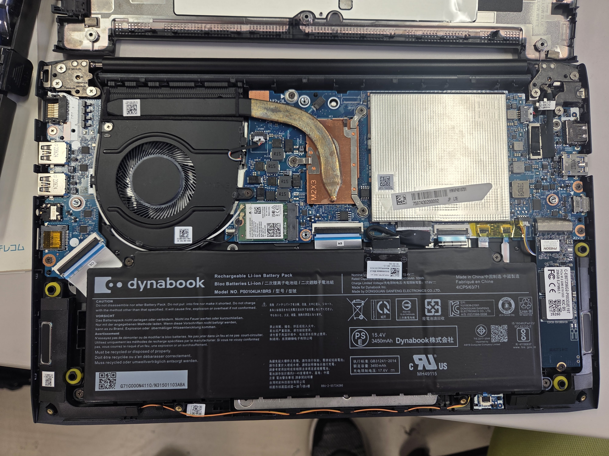
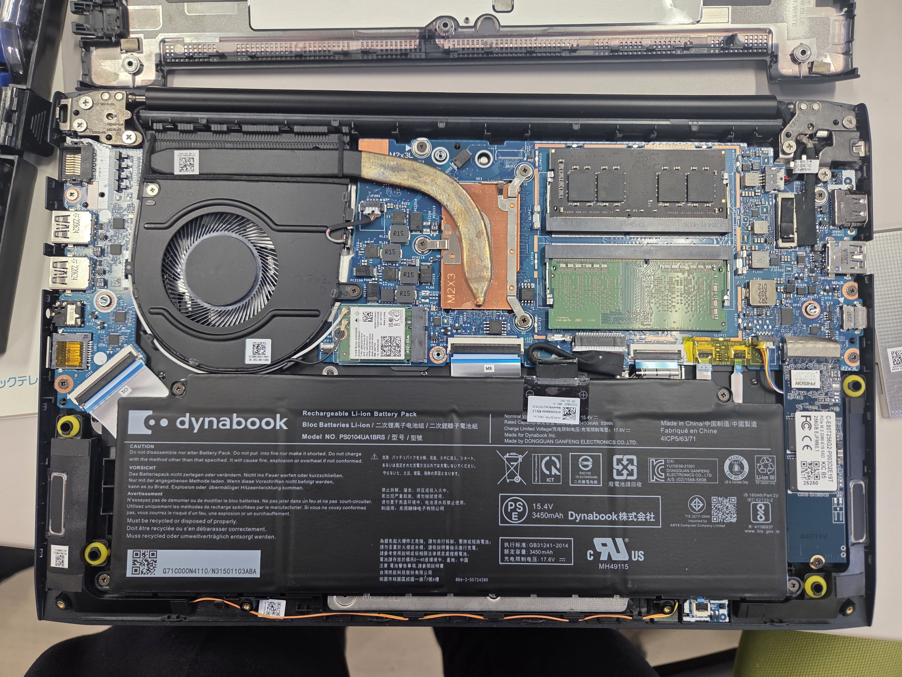

## はじめに
Dynabook MJ64/KVのメモリ増設を行いました.

メモリスロットは2つあるため増設が可能ですが, 公式見解では増設はできないとされています. しかし, 実際には増設可能でしたのでこの記事では, その様子を紹介します.

公式のメモリ交換不可の表示

## メモリ交換の準備
まず, ネジを外し裏側の蓋を開けます.

蓋を開けた状態

この画像の右上にある銀色の部分がメモリスロットです. ここにメモリを取り付けるには, 爪で固定されているので, それを外す必要があります. 慎重に外すと, メモリスロットが見えます.
あとは, メモリを取り付けるだけです.

