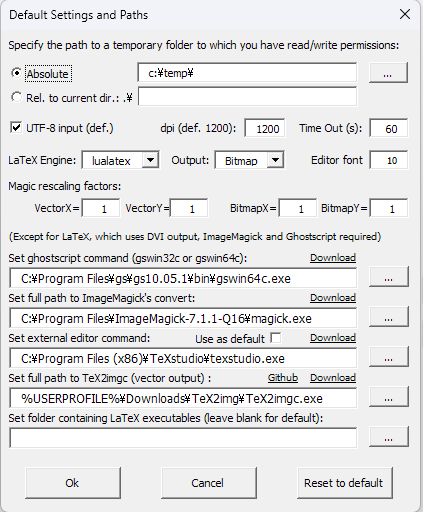
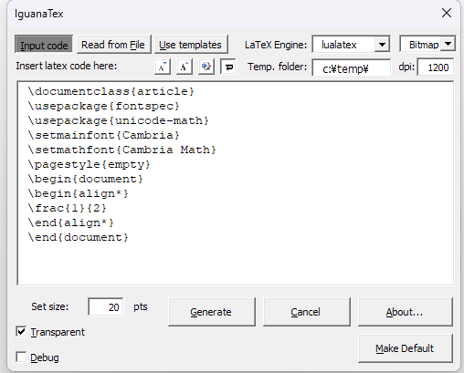
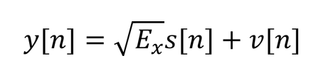

## はじめに
[Iguana Tex](https://texwiki.texjp.org/?IguanaTex) は PowerPoint で数式を簡単に書くためのアドインです. これを使うことで, 数式を LaTeX で書くことができ, 数式の編集が楽になります.

個人的には, 文中の数式を書く場合, 標準数式エディタのほうが楽だと思いますが, 併用するためにアドインとのフォントを合わせる必要があります.

PowerPoint の数式エディタは, 標準フォントがCambria Math であり, 基本的に変更ができないので, それに合わせて Iguana Tex のフォントを変更する必要があります.

この記事では, その方法を紹介します.

## Iguana Tex のインストール
Iguana Tex のインストールは, [こちら](https://texwiki.texjp.org/?IguanaTex) を参考にしてください.

## Iguana Tex のフォント変更
フォントを変更するために, 標準のコンパイル方式であるLaTex(DVI)ではなく, LuaLaTex を使用します.

アドインが追加されたら, PowerPoint を起動します.

Iguana Tex のタブをクリックし, [IguanaTex] - [Main Settins] を選択します.


<div style="text-align: center;">
Iguana Tex の設定
</div>

ghostscript とImageMagick をダウンロードボタンからダウンロードします.

ダウンロードした場所の, gswin64c.exe, magick.exe を指定します.

[IguanaTex] - [New LaTex display] を選択します.

<div style="text-align: center;">
入力画面
</div>

この画面に以下のコードを入力しGenerate をクリックしたら出力されます.
```latex
\documentclass{article}
\usepackage{fontspec}
\usepackage{unicode-math}
\setmainfont{Cambria}
\setmathfont{Cambria Math}
\pagestyle{empty}
\begin{document}
\begin{align*}
y[n]=\sqrt{E_x}s[n]+v[n]
\end{align*}
\end{document}
```

<div style="text-align: center;">
出力画面</div>
