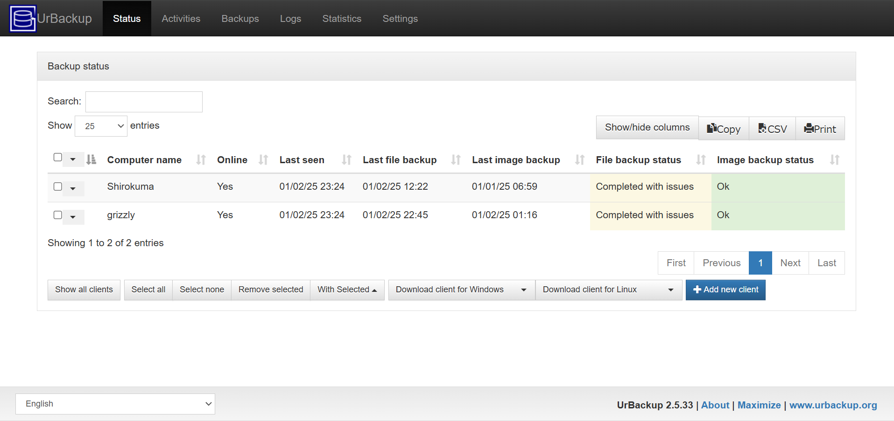
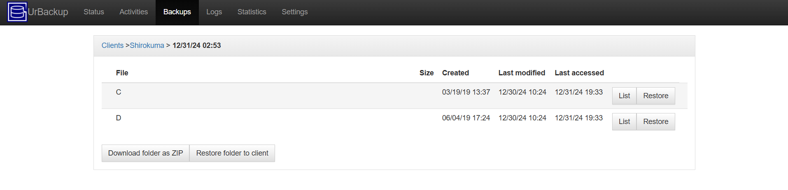
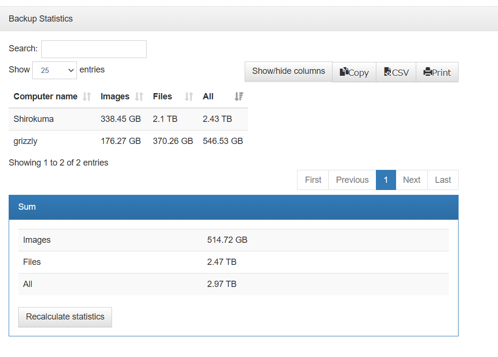

## はじめに
Windows11 でバックアップを取るとき, ファイル履歴やバックアップと復元があるけど使いにくかったです. 探してみると年契約のサブスクなどはあっても無料でいい感じのものがあまり見浸からず...そんなときにフリーで使えるツールがあったので紹介します.
## UrBackup
[UrBackup](https://www.urbackup.org/) はオープンソースのバックアップツールで基本WebGUIで操作します. クライアントは Windows, Linux, macOS に対応しています.
下の画像のようにトップページから状況を確認できます.

UrBackup トップページ

### インストール
[Download](https://www.urbackup.org/download.html) からサーバーとクライアントをダウンロードしてインストールします.
### サーバー設定
[OpenSUSE Build Service](https://software.opensuse.org/download.html?project=home%3Auroni&package=urbackup-server) で使うOSに合わせてインストールします.
インストール後, 起動して保存場所を設定しブラウザで `http://localhost:55414` にアクセスします.
(ベーシック認証をGUIで設定することもできます)
### クライアント設定
クライアントを起動します. Server URL を `urbackup://localhost:55414` に設定して接続します.
バックアップ時にはアイコンが黄色になり, バックアップが完了すると白色になります.

### 使ってみる
バックアップしたデータが必要になったときは, Restore を使用するよりもZipファイルをダウンロードして解凍する方が良さそうです.

バックアップした容量などを確認することもできます.

### バックアップの種類
・ Incremental file backup (ファイルの差分バックアップ)

・ Full file backup (ファイルのフルバックアップ)

・ Incremental image backup (イメージの差分バックアップ)

・ Full image backup (イメージのフルバックアップ)

時間や保存回数などの設定もできます.

## まとめ
オープンソースのバックアップツール UrBackup を使ってみました. インストールも簡単で使いやすいです. 設定も運用も簡単なので, ぜひ試してみてください !
