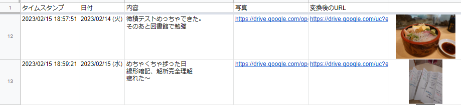
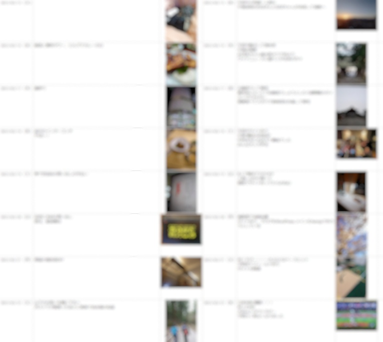

日記アプリでつけるとサービス終了に怯えながら生きなければならないし，カレンダーアプリだと一覧性が悪くなってしまう．だったら作ろうとなった．

### 表計算ソフト or Notion

最初，Notion のデータベースあたりに作ろうとしたが，どん溜まっていく一方になってしまった．そのデータをエクスポートして整理することも考えたが，だったらスプレッドシートでいいではないか!

### Google Form と スプレッドシートの組み合わせ

結局これが一番楽

日付，内容，写真を Google Form に書くことで連携したスプレッドシートで拾って，Google Drive に上がった写真の URL を IMAGE 関数で表示できるように変換すれば完成！

Google Form の集計シート から IMPORTRANGE 関数を使用して新たなまとめシートに転記し，URL を変えて IMAGE
関数で表示させた．

まとめシートができたら，見やすいシートを作りそこに転記すれば完成！！

これを 365 行 ×10 年やりたいなぁ．

