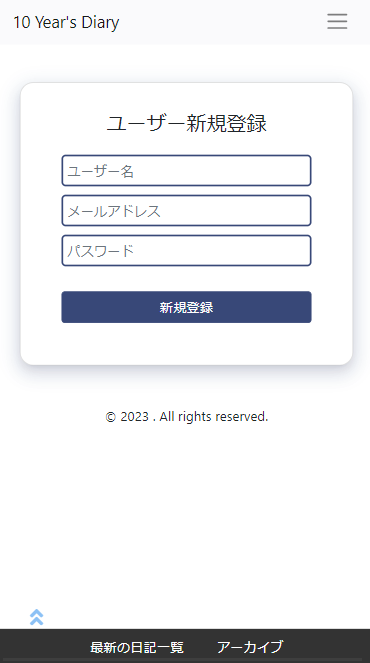
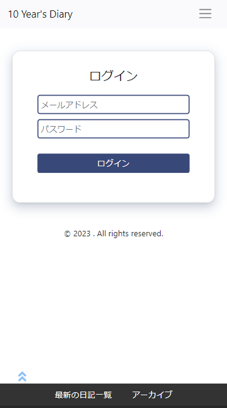
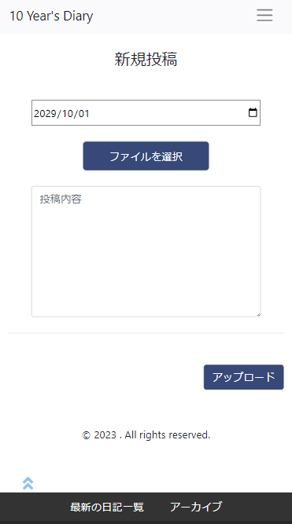
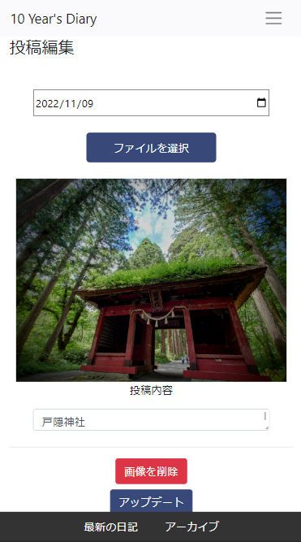
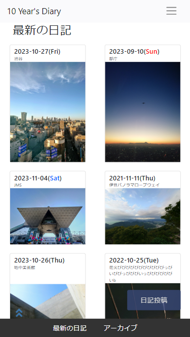
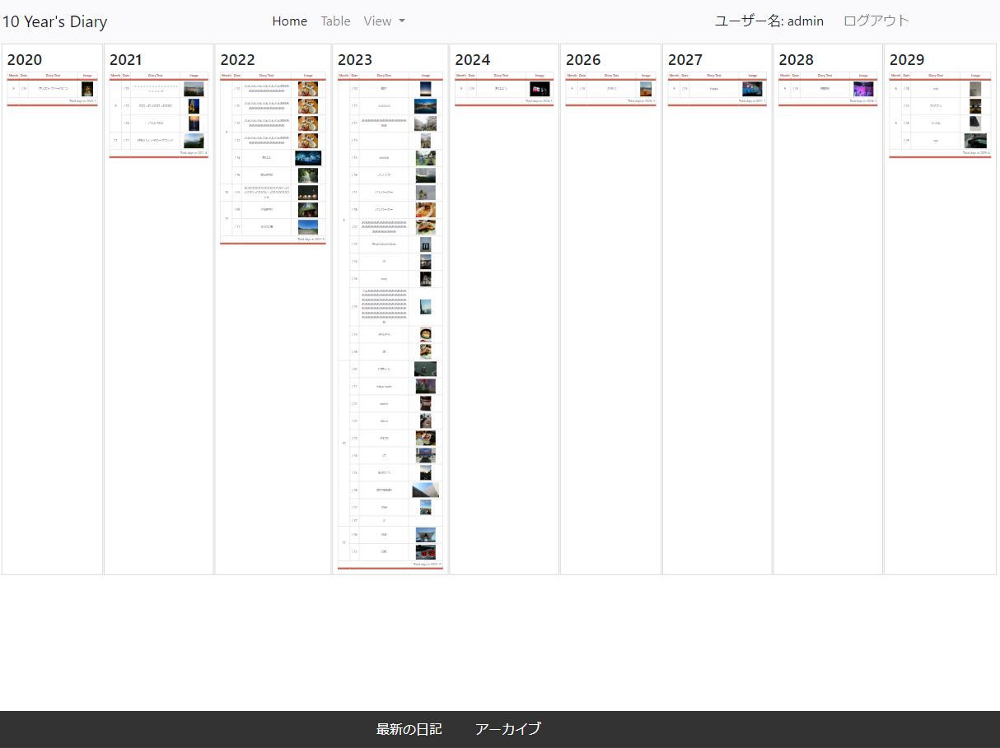
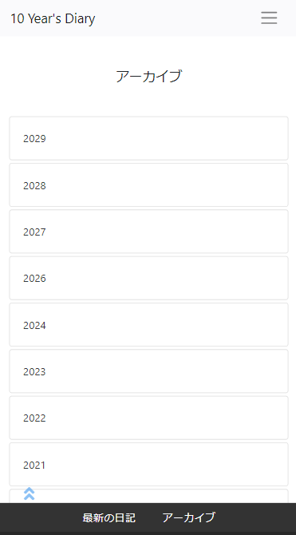
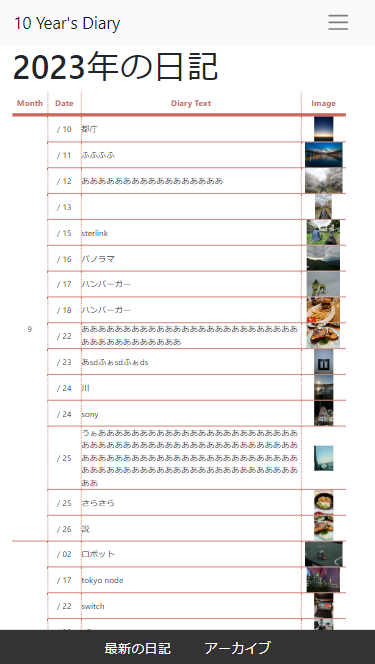
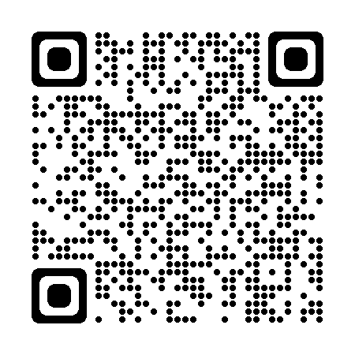

# 制作動機

これまで, Google Form を用いて日記を書いてスプレッドシートをデーターベースとして使っていました.ですが, あとから内容の修正がシートからでしかできない, 内容が増えるほどシートが大きくなり見返すときに重くなるなど欠点が多々ありました.写真を見るのもセル内挿入では画質が荒いので, リンク先に飛んでドライブに入っているファイルを開かなければなりません(そもそも圧縮されて保存されます).そこで今回勉強がてら日記の投稿, 検索ができ高画質な写真を残せる Web アプリを作りました.

# 主な仕様

- Flask(Python の Web フレームワーク)
- sqlite(データベース)
- bootstrap(CSS のデザインテンプレとして利用)

# このアプリの構造

## ディレクトリ

このアプリは主に 3 つで構成されていて Flask 公式チュートリアルを参考に作りました.図は簡易的なディレクトリ構造です.\\

### auth

認証関連の機能を提供しています.主にユーザー認証や新規登録に関する機能があります.

### crud

CRUD（Create, Read, Update, Delete）操作に関連するアプリです.主な機能はユーザーデータの作成,編集,表示などの基本的な操作を提供します.

### diary

日記に関連するアプリケーションで,コンテンツの表示や編集を担当します.メインのページデザインは diary 内の base.html で行っています.ユーザーはこのアプリを使用して日記を投稿し,投稿した画像はユーザごとに images 内にフォルダを作成し,そこに画像が保存されるようになっています.

```
.
├── apps
 │ ├── auth
│ │ ├── templates
│ │ │ └── ~.html
│ │ ├── forms.py
│ │ └── views.py
│ ├── crud
│ │ ├── templates
│ │ │ └── ~.html
│ │ ├── forms.py
│ │ ├── models.py
│ │ └── views.py
│ ├── diary
│ │ ├── templates
│ │ │ ├── base.html
│ │ │ └── ~.html
│ │ ├── forms.py
│ │ ├── models.py
│ │ └── views.py
│ ├── images
│ │ └── [userid]
│ └── static
│ ├── css
│ │ ├── bootstarp.min.css
│ │ └── style.css
│ ├── images
│ └── js
│ └── nav.js
├── app.py
├── config.py
├── .env
└── local.sqlite
```

# 何ができるようになった？

## ユーザー認証

サイトを公開する予定なので他のユーザーから自分の投稿が見られないようにする必要があり,ログイン認証をつけました.パスワードはハッシュ化してデータベースに格納します.今は,パスワードの再設定が管理者しかできないので近いうちにできるようにします.加えて Google アカウント認証も触ってみたいので実装できたらいいです.

```python
@auth.route("/signup", methods=["GET", "POST"])
def signup(): # SignUpForm をインスタンス化する
form = SignUpForm()

    if form.validate_on_submit():
        user = User(
            username=form.username.data,
            email=form.email.data,
            password=form.password.data,
        )

        # メールアドレス重複チェックをする
        if user.is_duplicate_email():
            flash("指定のメールアドレスは登録済みです")
            return redirect(url_for("auth.signup"))

        # ユーザー情報を登録する
        db.session.add(user)
        db.session.commit()

        # ユーザー情報をセッションに格納する
        login_user(user)

        # GETパラメータにnextキーが存在し,値がない場合はユーザーの一覧ページへリダイレクトする
        next_ = request.args.get("next")
        if next_ is None or not next_.startswith("/"):
            next_ = url_for("diary.index")
        return redirect(next_)

    return render_template("auth/signup.html", form=form)

@auth.route("/login", methods=["GET", "POST"])
def login():
form = LoginForm()

    if form.validate_on_submit():
        # メールアドレスからユーザーを取得する
        user = User.query.filter_by(email=form.email.data).first()

        # ユーザーが存在しパスワードが一致する場合はログインを許可する
        if user is not None and user.verify_password(form.password.data):
            login_user(user)
            return redirect(url_for("diary.index"))

        # ログイン失敗メッセージを設定する
        flash("メールアドレスかパスワードか不正です")
    return render_template("auth/login.html", form=form)

@auth.route("/logout")
def logout():
logout_user()
return redirect(url_for("auth.login"))
```





## 日記の投稿

日付,写真ファイル,投稿内容をに記入するとデータベースに userID や,乱数で生成した写真ファイル名,内容などを保存します.投稿したら最新の投稿一覧に飛びます.デフォルトの日付は，一番最後に投稿した日付の次の日になります.

```python
@dt.route("/upload", methods=["GET", "POST"])
@login_required #日記をアップロード
def upload_diary():
form = UploadDiaryForm()
exist_dates = get_existent_dates()
latest_date = get_latest_date()
date = form.date.data
diary_text = form.diary_text.data

    if form.validate_on_submit():
        if date in exist_dates:
            flash('その日付の日記は既に存在します', 'error')
            return  redirect(url_for("diary.edit_diary",date= date))
        else:
            if form.image.data is not None:
                # 画像がアップロードされている場合の処理
                user_directory = os.path.join(current_app.config["UPLOAD_FOLDER"], str(current_user.id))
                os.makedirs(user_directory, exist_ok=True)
                file = form.image.data
                ext = Path(file.filename).suffix
                image_uuid_file_name = str(uuid.uuid4()) + ext
                image_path = os.path.join(user_directory, image_uuid_file_name)
                file.save(image_path)

                # DBに保存する
                diary = UserImage(user_id=current_user.id, image_path=image_uuid_file_name, date=date, diary_text=diary_text)
            else:
                # 画像がアップロードされていない場合の処理
                diary = UserImage(user_id=current_user.id, image_path=None, date=date, diary_text=diary_text)

            db.session.add(diary)
            db.session.commit()
            return redirect(url_for("diary.all_diary"))
    return render_template("diary/upload.html", form=form, exist_dates=exist_dates, latest_date=latest_date)
```

## 日記の編集

日記の編集は，削除ボタンが押されたときに消され，そうでない場合内容に変更になくても日付と内容は上書きします．画像はアップロードすると上書きされるようにしました．改善点としてボタンを押したときに確認画面を出すようにしたいです．

```python
@dt.route("/diaries/<string:date>/edit", methods=["GET", "POST"])
@login_required
def edit_diary(date):
target_date = datetime.strptime(date, "%Y-%m-%d").date()
form = UpdateDiaryForm()

    # GETリクエストの場合,データベースから日記データを取得
    diary = (
        db.session.query(User, UserImage)
        .join(UserImage)
        .filter(User.id == UserImage.user_id)
        .filter(User.id == current_user.id)
        .filter(target_date == UserImage.date)
        .first()
    )
    if request.method == 'POST':
        if form.delete.data:
            # 削除ボタンがクリックされた場合,日記を削除する
            db.session.delete(diary.UserImage)
            db.session.commit()
            return redirect(url_for('diary.index'))
        # フォームから新しいテキストと日付を取得
        new_diary_text = form.diary_text.data
        new_date = form.date.data

        # 日記の属性を更新
        diary.UserImage.diary_text = new_diary_text
        diary.UserImage.date = new_date
        diary.UserImage.updated_at = datetime.now()

        # アップロードされた画像ファイルを取得する
        file = form.image.data
        if file:
            # ファイルのファイル名と拡張子を取得し,ファイル名をuuidに変換する
            ext = Path(file.filename).suffix
            image_uuid_file_name = str(uuid.uuid4()) + ext
            # 画像を保存する
            user_directory = os.path.join(current_app.config["UPLOAD_FOLDER"], str(current_user.id))
            os.makedirs(user_directory, exist_ok=True)
            image_path = os.path.join(user_directory, image_uuid_file_name)
            file.save(image_path)
            diary.UserImage.image_path = image_uuid_file_name
        # データベースを更新
        db.session.commit()

        return redirect(url_for('diary.view_diaries', date=new_date)) # 日記一覧ページにリダイレクト


    return render_template('diary/edit.html', diary=diary, form=form)  # 日記編集フォームを表示
```




## 日記の検索

キーワード検索,日付から過去の日記を遡って見れるようにしました.トップページに過去の同一日の投稿と検索ボックスを置きました.

```python
# 検索ページと検索結果を表示するルート

@dt.route("/", methods=["GET", "POST"])
@login_required
def search_diary():
form = SearchDiaryForm()
if request.method == "POST": # SQLite データベースから日記を検索するクエリを実行
diaries = (
db.session.query(User, UserImage)
.join(UserImage)
.filter(User.id == UserImage.user_id)
.filter(User.id == current_user.id)
.order_by(desc(UserImage.date))
)
search_term = request.form.get("search_term")
search_date_str = request.form.get("search_date")
if not search_date_str or search_term:
flash("どちらかを選択してください", "danger")
return redirect(url_for("diary.search_diary"))
if search_date_str:
try:
search_date = datetime.strptime(search_date_str, "%Y-%m-%d").date()
diaries = diaries.filter(UserImage.date == search_date)
except ValueError:
return redirect(url_for("search_diary"))
if search_term:
diaries = diaries.filter(UserImage.diary_text.like(f"%{search_term}%"))
diaries = diaries.order_by(desc(UserImage.date)).all()
return render_template("diary/search.html", current_date=current_date, current_day=current_day, diaries=diaries, search_term=search_term,form=form,search_date=search_date)
return render_template("diary/search.html", current_date=None, current_day=None, diaries=None, search_term=None,form=form)
```

## 一覧画面





## 最新の投稿を表示

投稿した内容を更新履歴の新しいのものから表示します.投稿を選択すると編集画面に飛ぶようになっています．ここは,重くならないようにページネーションをつけました.

## 全投稿を表示

10 年日記を作るんだったら,激重全日記表示ページを作りたかったので拡大すると高画素な写真を見れるページを作りました.処理時間が結構掛かるのでローディング画面があると良いなと思っています.

## 過去の日記を表示

年別で過去の日記を見ることができます.選択すると月別で過去の日記を見ることができます.ここでも，投稿を選択して編集画面に移動できます.





# まとめ

最初は何からやっていいか分からなかったのでユーザー認証やベースの構造を Flask の公式チュートリアルを参考に進めました.基礎ができれば全く分からないということは無く，作っていて少しづつ進化している感があり楽しかったです.今はローカルサーバを立てて見ているので,そろそろ日常的に使えるよう家のサーバーで運用できるようにしたいと思います.使ってみて気になるところがあれば随時更新できるのも良いです.今後は機能追加と同じようなコードが乱立していて見にくいので,使い回しのコードを整理していきたいです.

<!--  -->
