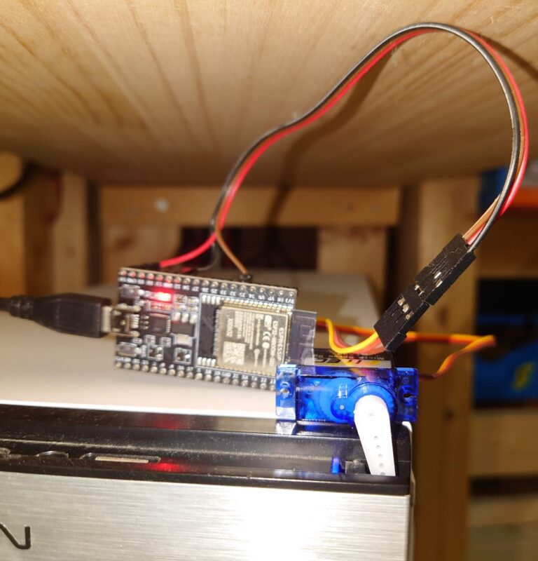
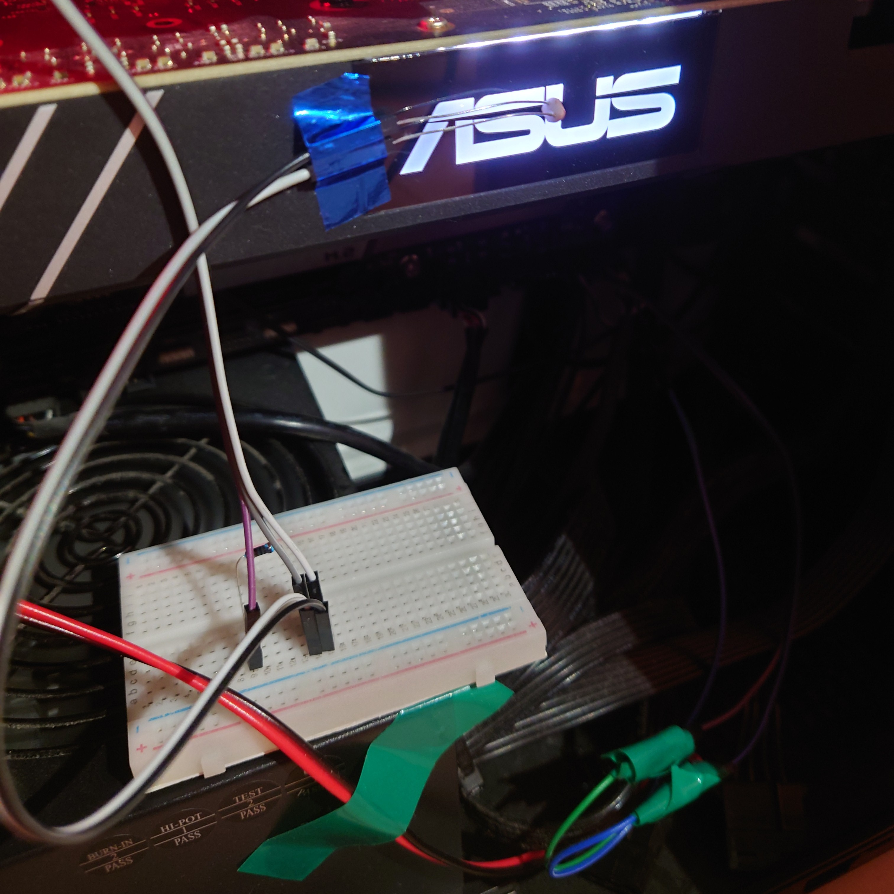

以前から Google リモートデスクトップ使って iPad やスマホで家のデスクトップ PC を遠隔で動かしていました．ですが，PC が寝室にあるので電源を常時付けておく訳にもいかず遠隔で電源を操作したい！！



最近 Amazon で SwitchBot やそれに似た製品でスマホからスイッチを押すことができる装置が売られています．が，少々高いので ESP32 を用いてサーボモータを動かし，直接電源ボタンを押すことにしました.

### 用意したもの

- USB ケーブル
- ESP32
- サーボモーター (FS90)
- スマホアプリ "Blynk"

### 操作アプリ

電源を押す操作をするために Blynk loT というアプリを使いました．基本は無料ですが機能拡張したい場合はサブスクで使うことができます．アプリと ESP32 を連携するためには，メールで送られたサイトから固有のトークンをプログラムに貼り付けるだけでした．少しもの足りなかったので外から電源が入っているかを確認するために GPU の光るロゴに光センサーを取り付けて判定しました．

<br />



```cpp
//スマホ側で与えられたもののコピー
#define BLYNK_TEMPLATE_ID           "                 "
#define BLYNK_DEVICE_NAME           "                 "
#define BLYNK_AUTH_TOKEN            "                 "
//
#define BLYNK_PRINT Serial
#include <WiFi.h>
#include <WiFiClient.h>
#include <BlynkSimpleEsp32.h>
#include <Servo.h>
Servo myservo;
char auth[] = BLYNK_AUTH_TOKEN;
const char* ssid = "//ESP32に接続するwi-fiのssid";
const char* pass = "//wi-fiのパスワード";

void setup()
{
myservo.attach(32);
Serial.begin(115200);
Blynk.begin(auth, ssid, pass);
Serial.println("connected");
}
void loop()
{
Blynk.run();
}
int cnt = 0; //2 回に 1 回動くようにカウントする変数をおく
BLYNK_WRITE(V0)
{
if (cnt == 0){
myservo.write(0); //30 度回転
delay(150);
myservo.write(30); //元に戻る
delay(150);
cnt = 1;
}else{
cnt = 0;
}
}

```

操作画面

PC の電源がついているか分かるように表示を付けて，ボタンを押したいときに動作するようにした．

<br />


### 実際にやってみて

とりあえず目標であった外出先からパソコンの電源をつけるものを作ることができました．ビックカメラにサーボモーターが投げ売りせれていたこともあり，計 1500 円程度で作ることができました．今回は，Blynk loT というアプリを使ってサーバーなどを気にせずに操作できるようにしたのですが，次の目標としてサーバーを立てて外からでも WEB 等で ESP32 を制御できるようにしたいです．
