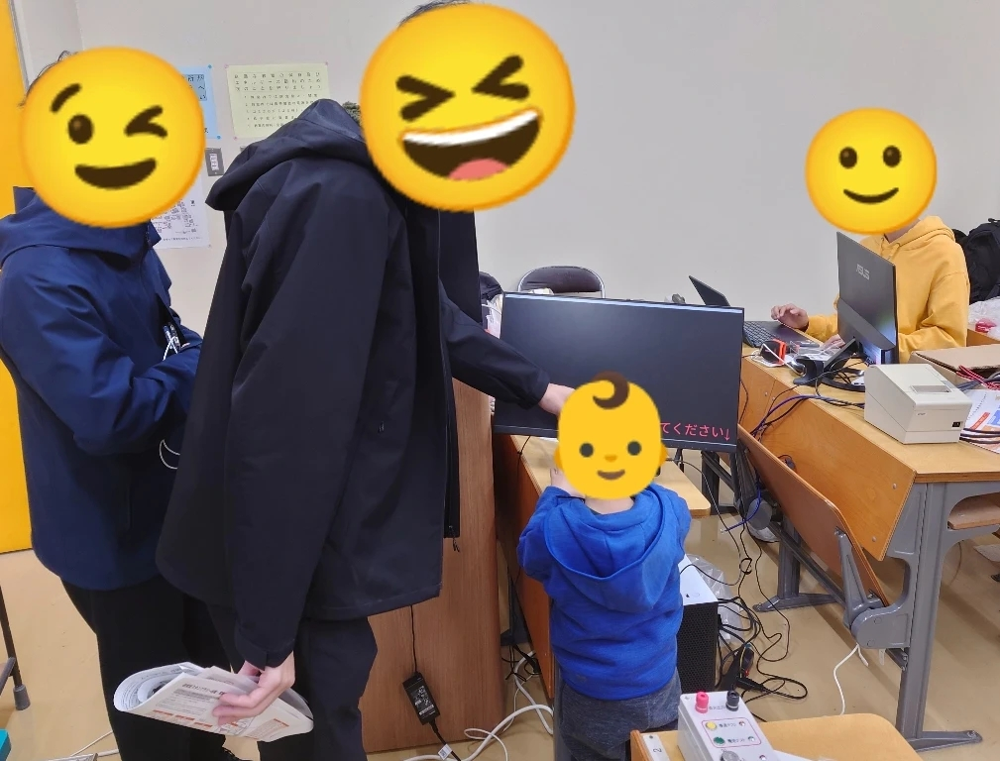

## この記事は, <a href="https://adventar.org/calendars/10770">MMA Advent Calendar 2024</a> 5日目の記事です．

### はじめに

MMAは，ソフトウェアに関することなら何でもするサークルです. って良く言うのですが, あまりに活動内容が自由で幅が広く，何をやっているか説明しづらいうえに文化祭で展示できるものが少ない...  そこで個人的にも<a href="https://rhizomatiks.com/">Rhizomatiks</a>などのメディアアート好きなことから, 小さな子どもでも楽しめるビジュアル映えする展示物を作ることにしました.

MMAの合宿では毎年打ち上げ花火を上げることが恒例で前年度の合宿&花火担当でもあったことから, 実際に打ち上げた気分になれる"爽快！打ち上げ花火シミュレーター" を制作しました. 作り方は単純です.

### 使用したもの

- デスクトップPC
- Touch Designer(アプリ)
- ESP32
- 赤いボタン
- 献血でもらったモバイルバッテリー

### 基本構成

大きく分けて2つあります． A. PCに信号を送る打ち上げ装置, B. 信号が来たら演出が起動する画面です. 信号はBluetooth キーボードとして, ボタンが押されたらキー入力を送ります.

### A. PCに信号を送る打ち上げ装置
Bluetoothモジュールが内蔵したESP32で <a href="https://github.com/T-vK/ESP32-BLE-Keyboard/">ESP32-BLE-Keyboard </a>というライブラリを使用しました. ほぼサンプルコードそのままで，実際の押したときにledが光る挙動を加えました． 打ち上げ装置は３Dプリンターで印刷．

打ち上げ装置

参考にした本物の打ち上げ点火装置

### B. 演出が起動する画面
Touch Designer は, ノードを繋げることでプログラムを作成できるソフトウェアです. これで音声やその他入力に対してリアルタイムにイケイケな映像を作成することができます. 花火の開く部分は<a href="https://youtu.be/GH73XIP9so8?si=hdJaHwT6JTG7nUOT
">ぎまパパチャンネル TouchDesigner Particle Fireworks[パーティクルで花火]</a>を参考に打ち上がる部分， 挙動に合わせた音，キーボード入力などを加えました． 実際に作成したものは以下の通りです.

ノード画面

### 完成！
あまり撮っていなかったので映像が微妙です...

実際の挙動

文化祭では，こんな微笑ましい光景もありました．

文化祭での１コマ

お父さんがジャンク品を見ている間，ずっと遊んでくれた子もいて，作ってよかったです．目標達成！

#### おまけ
メディアアートといえば，<a href="https://www.tokyonode.jp/sp/perfume/">Perfume 25周年イベント</a>(2024/10)に行ってきました．といっても，半分は冒頭でも紹介した技術集団 Rhizomatiksの展示みたいな感じでした．手に追従するレーザーや，影みたいな映像などなど...[引用参照]． 実は， <a href="https://www.tokyonode.jp/sp/syn/">TokyoNodeのこけら落としイベント</a>(2023/10)にも行っています．

<a href="https://www.tokyonode.jp/sp/perfume/highlights/">引用元</a>

ついでに展示されていたソニー・ホンダモビリティ の AFEELA 2023年モデル．かっこよかったです．センターコンソールにはPS5のコントローラーがありました．

